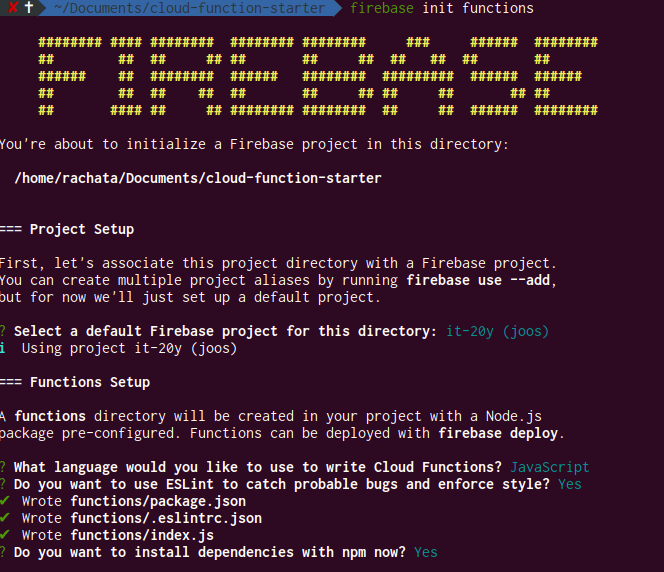

# Firebase Cloud Function Starter :star:
Starter project for create restAPI with firebase cloud function and firebase Realtime Database(RDB).

## Node Version
```
node -v
v10.9.0
```

## Installation
**1. Set up Node.js and the Firebase CLI** 
install **firebase-tools** to deploy functions to the Cloud Functions runtime.
```
npm install -g firebase-tools
```

**2. Login Firebase** 
to login via the browser and authenticate the firebase tool.
```
firebase login
```


**3. Initialize Firebase SDK for Cloud Functions** 
to create dependencies for your project. **You can run!**

```
firebase init functions
```


## Build run and deploy!
**1. Change Directory to functions folder**
```
cd functions
```

**2. Build and Run in local** develop in local server running on port 5000.
```
npm run serve
```
example.
```
http://localhost:5000/<project-name>/<firebase-server>/helloWorld
```
**3. Deploy** function to firebase.
```
npm run deploy
```